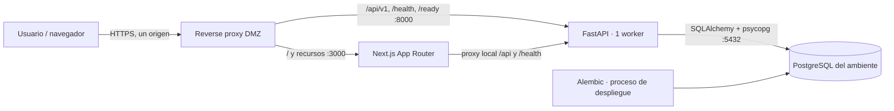
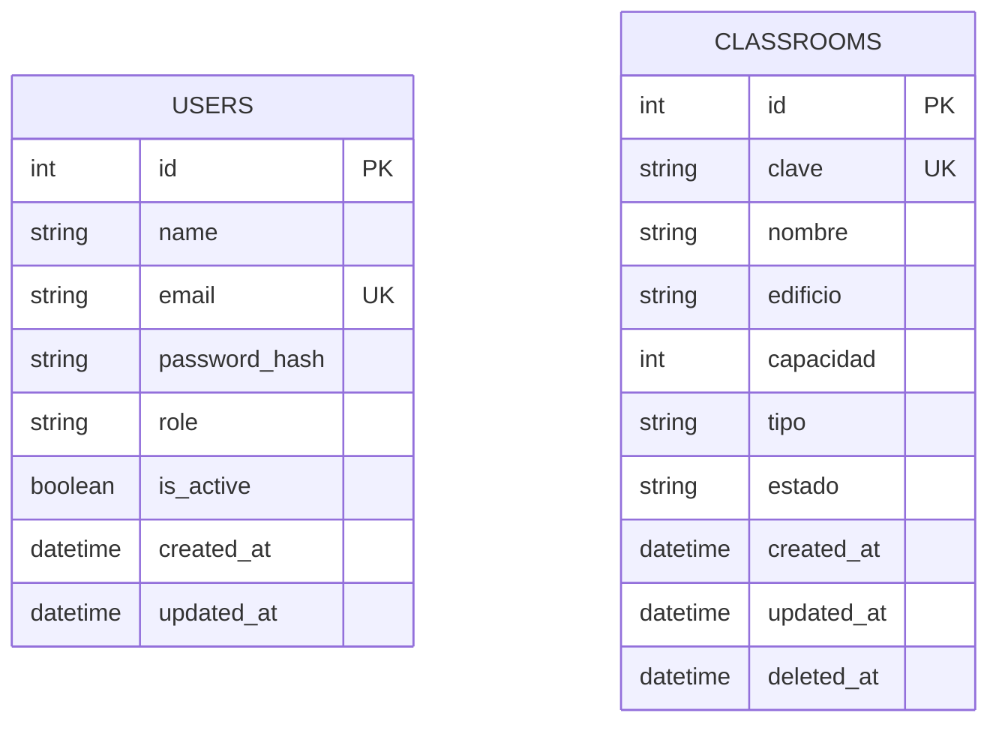

# Arquitectura de AulaData

AulaData administra aulas con una aplicación Next.js, una API FastAPI y PostgreSQL. Los servicios de aplicación pueden reiniciarse o moverse entre nodos; la información persistente vive en PostgreSQL. El proyecto usa un monorepo y una sola API para reducir consumo y complejidad.

En desarrollo local el navegador entra por Next.js. Sus rutas de servidor reenvían `/api/v1/*` y `/health` a `API_INTERNAL_URL`, que se lee en runtime y no se entrega al navegador. En el laboratorio el proxy externo puede enrutar directamente la API a FastAPI. En ambos casos el cliente usa rutas relativas y conserva un único origen.

## Componentes y responsabilidades

| Componente | Responsabilidad |
| --- | --- |
| `app/frontend` | Sesión, tabla filtrable, formularios, detalle y confirmación de baja. TypeScript y Tailwind. |
| `app/backend/app/routers` | Contrato HTTP, dependencias de sesión y permisos. |
| `app/backend/app/schemas` | Validación y respuestas públicas, sin hashes de contraseña. |
| `app/backend/app/services` | Reglas de aulas, unicidad y baja lógica. |
| `app/backend/app/auth` y `dependencies` | Hash Argon2id, firma/verificación JWT, sesión, rol y protección de mutaciones. |
| `app/backend/app/repositories` | Consultas parametrizadas mediante SQLAlchemy 2. |
| `migrations` | Historial único de esquema que se aplica a cada base independiente. |
| `tests/backend` | Validación HTTP con TestClient y base aislada. |
| `deploy` | Compose, imágenes, scripts de promoción, respaldo y reversión. |

## Modelo y permisos

`users` contiene nombre, correo único, hash de contraseña, rol `ADMIN` o `VIEWER`, estado activo y fechas. `classrooms` contiene clave única, nombre, edificio, capacidad positiva, tipo, estado y fechas. No hay relación artificial entre un aula y el usuario que la consulta.

La baja establece `deleted_at` y `estado=INACTIVA`. Las consultas ordinarias excluyen esas filas; la clave sigue reservada para conservar identidad histórica. El administrador crea, consulta, edita y da de baja; el observador consulta. FastAPI verifica el rol en cada mutación.

## Sesión y configuración

El login verifica el hash y entrega un JWT en una cookie `HttpOnly`, `SameSite=Lax`, con `Secure` cuando se usa HTTPS. La UI consulta `/api/v1/auth/me` al validar sesión y no guarda el JWT en `localStorage`. Las mutaciones requieren `X-Requested-With: AulaData` y se valida `Origin` contra `CORS_ORIGINS` cuando se proporciona. El listado de orígenes se configura explícitamente.

El proceso recibe `DATABASE_URL`, `JWT_SECRET` y metadatos por variables de entorno. `/health` entrega ambiente, versión y commit sin depender de la base; `/ready` prueba conexión de la base. Next.js presenta los metadatos recibidos en runtime. Los secretos permanecen en el servidor.

La autenticación se expresa en el contrato OpenAPI de FastAPI mediante cookie; no es un proveedor OAuth ni un inicio de sesión con terceros. [Seguridad y esquemas OpenAPI en FastAPI](https://fastapi.tiangolo.com/tutorial/security/).

## Ambientes del laboratorio

| Ambiente | Red | VM aplicación | VM/base PostgreSQL |
| --- | --- | --- | --- |
| DEV | `10.10.30.0/24` | `dev-app01`, `10.10.30.10` existente según contexto | `dev-db01`, `10.10.30.20`, `auladata_dev`: propuestos |
| QA | `10.10.40.0/24` | `qa-app01`, `10.10.40.10`: propuestos | `qa-db01`, `10.10.40.20`, `auladata_qa`: propuestos |
| PROD | `10.10.50.0/24` | `prod-app01`, `10.10.50.10`: propuestos | `prod-db01`, `10.10.50.20`, `auladata_prod`: propuestos |
| DMZ | `10.10.20.0/24` | `proxy01`, `10.10.20.10`: propuestos | Sin PostgreSQL público |

El contexto del usuario describe `pve1/2/3` en `10.10.10.11/12/13`, NFS `10.10.10.20`, storage `nfs-shared` y una migración live de `dev-app01` ya realizada. La implementación local no constituye una nueva verificación de esos equipos.

Cada ambiente debe tener su propia VM/instancia PostgreSQL, credenciales y base. El firewall permitirá únicamente la aplicación de ese ambiente hacia su base por `5432/TCP`. Ninguna IP propuesta se activa desde este repositorio.

## Recursos y promoción

La app VM objetivo tiene 2 vCPU y 2 GB RAM. Los contenedores de ejecución usan un proceso Next.js en producción y un worker Uvicorn; las compilaciones se realizan en la estación o CI. No se introducen Redis, colas ni servicios adicionales. Ajustar límites después de medir memoria y latencia reales.

Las imágenes de backend y frontend se construyen una vez por SHA. QA y PROD consumen las mismas referencias por digest; cambian únicamente configuración, credenciales y base. El modo standalone reduce lo que se copia al contenedor Next.js. [Self-hosting y configuración runtime de Next.js](https://nextjs.org/docs/app/guides/self-hosting).

El registro de promoción guarda SHA de Git y ambos digests. Un tag mutable por sí solo no prueba igualdad de artefactos. [Descarga de imágenes por digest en Docker](https://docs.docker.com/reference/cli/docker/image/pull/).
