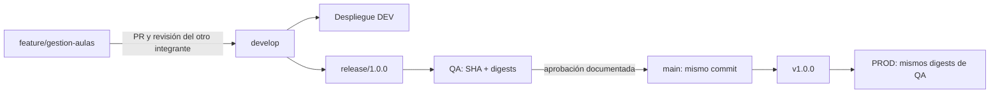

# Git y trazabilidad de promoción

La rama de implementación es `feature/gestion-aulas`. El flujo académico objetivo es:



## Historial de trabajo

Los commits se realizan por bloques revisables: backend, pruebas, frontend, integración, despliegue y documentación. El usuario autorizó las identidades `AegisOdin <odingarra@gmail.com>` y `JuanPaGargoo <juanpablogargoo@gmail.com>`, con más commits bajo AegisOdin. La autoría Git no prueba una revisión humana; el trabajo fue implementado con asistencia de Codex y la revisión del otro integrante debe registrarse por separado.

Consultar autor y committer sin modificar la configuración global:

```bash
git log --format='%h | %an <%ae> | %cn <%ce> | %s'
git status --short
git branch --show-current
```

Antes de publicar, inspeccionar el diff y confirmar que `.env`, cookies, dumps, credenciales y archivos locales de sesión no estén en staging. Las capturas guardadas deben omitir contraseñas, tokens y datos personales innecesarios.

## PR, DEV y candidato

1. Configurar el remoto real del repositorio y publicar las ramas.
2. Abrir PR `feature/gestion-aulas` → `develop` con alcance, comandos y resultados de pruebas.
3. El otro integrante revisa y registra observaciones/aprobación en el PR.
4. Integrar a `develop`, ejecutar CI y desplegar DEV con su manifiesto de imágenes.
5. Crear `release/1.0.0` desde la revisión de `develop` aceptada y desplegar ese candidato en QA.
6. Guardar SHA completo, digests, revisión Alembic, pruebas y captura del ambiente QA.

No marcar como realizados el PR, su revisión, QA o PROD hasta contar con sus enlaces/evidencias. La configuración del pipeline no implica que haya corrido en GitHub.

## Conservar el commit aprobado

El commit etiquetado debe ser exactamente el validado en QA. Una política sencilla es mantener `main` como ancestro del candidato y usar avance rápido al promover:

```bash
git fetch origin --tags
git switch main
git merge --ff-only release/1.0.0
git tag -a v1.0.0 -m 'AulaData 1.0.0: candidato aprobado en QA'
git rev-parse HEAD
git rev-parse 'v1.0.0^{commit}'
```

Estos son comandos para ejecutar después de la aprobación real. Si el repositorio exige merge commits o squash y cambia el SHA, hay que validar ese nuevo commit en QA antes de etiquetarlo; no afirmar que un SHA diferente es el candidato original.

Para PROD utilizar el manifiesto de imágenes aprobado en QA. No reconstruir imágenes por crear el tag. Publicar el tag y avanzar `main` solo como parte de la promoción aprobada.

## Evidencia mínima por promoción

| Dato | Registro |
| --- | --- |
| Código | SHA completo y enlace al commit/PR |
| Artefactos | Referencia `registry/imagen@sha256:...` de backend y frontend |
| Esquema | Salida de `alembic current` |
| Configuración | Ambiente y orígenes públicos; nunca los valores secretos |
| Validación | Resultado CI, smoke tests y `/health` |
| Decisión | Integrante, fecha y aprobación real de QA/PROD |
| Recuperación | Manifiesto anterior y referencia del respaldo |

Configurar los ambientes GitHub `DEV`, `QA` y `PROD`, restringir ramas y exigir revisión de PROD según las posibilidades del plan. La protección se configura en GitHub y no nace únicamente por declarar `environment` en YAML. [Administración de ambientes de GitHub Actions](https://docs.github.com/en/actions/how-tos/deploy/configure-and-manage-deployments/manage-environments).
